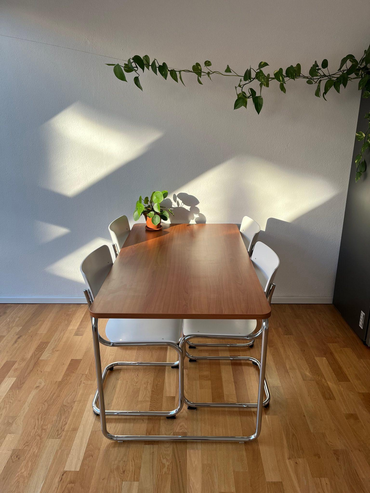
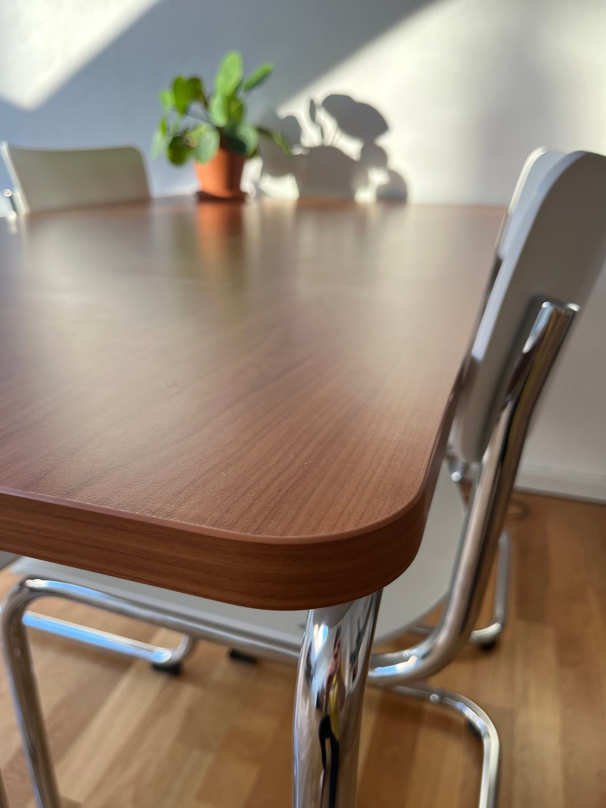

+++
date = 2023-05-03
title = "I bought a table"
description = "I bought a table for the first time in my life. Here is a review of the L&C Stendal Layko to help others curious about it"
image = "layko_cover.jpg"
+++

This post is a mix of a personal story and a product review.
I ordered a table for the first time in my life and tried to strike a good balance between aesthetics and cost. Until a year ago, I lived out of furnished student housing or shared flats. This table would be one of the first pieces of furniture for me, so this felt like a significant purchase to me.

Having traveled to Dessau in Sachsen-Anhalt several times, the Bauhaus school era left a lasting impression on me. My girlfriend already owned a desk citing this design school, a Thonet S1200. I decided that I would like to have a table with similar design characteristics. It should be well-crafted, easy on the eye, and unobtrusive. The term for this seems to be *tubular steel furniture* or *Stahlrohrmöbel* in German.

I deemed these to be simple characteristics, but many of the affordable options on the market were very heavy, and made out of thick wood. As I learned, thick wood sounds better than it is. It can warp over time, unlike pressed wood. Steel feet and a wooden platform on top are low-cost, but not in Stahlrohr table world. Here, Thonet rules supreme, charging over 2000 Euro for a table. Used tables were expensive, and often quite run-down or even rusty.

Then I discovered L&C Stendal, a small furniture company close to Magdeburg. They have specialized in *Stahlrohrmöbel*, and offer a wide range of products. My choice fell on the Layko table. At 500 Euro, it offered the best value of all models I had seen until then.
Frustratingly, the whole internet had no reviews or pictures of the table in real-life.
This led me to write this post.

After several calls with L&C Stendal, I had figured out how to order, choosing from a catalog of furnishings, sizes and feet colors. I placed the order on August 19, and received the table on October 13. The largest size of 140x80 with a cherry wood furnishing would take longer, I was told.

Paired with Thonet S42 chairs, it looks great. The ensemble does not dominate the room. As I was made aware on the phone, the table is prone to swinging. It does so quite heavily when writing on it. However, I developed a writing technique to keep the swing to a minimum and use the table mostly to eat at.

As it turned out later, the table had a few optical defects. The glued edge had wide gaps in some places and some tubes were scratched. In a brief exchange with the company, we agreed that a replacement would be sent. It arrived in March in perfect condition.

Thank you L&C! Keep making affordable beautiful products!
