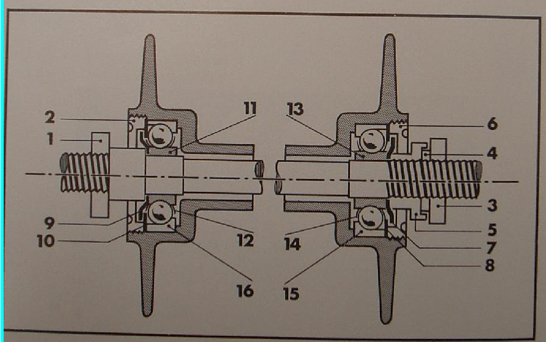
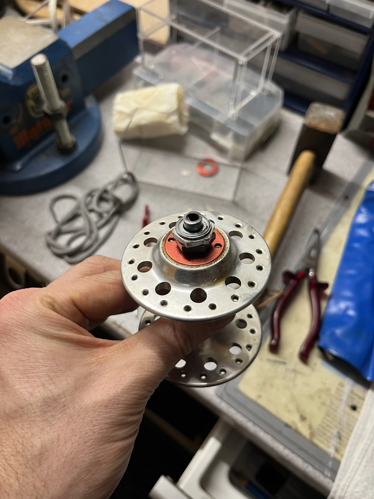
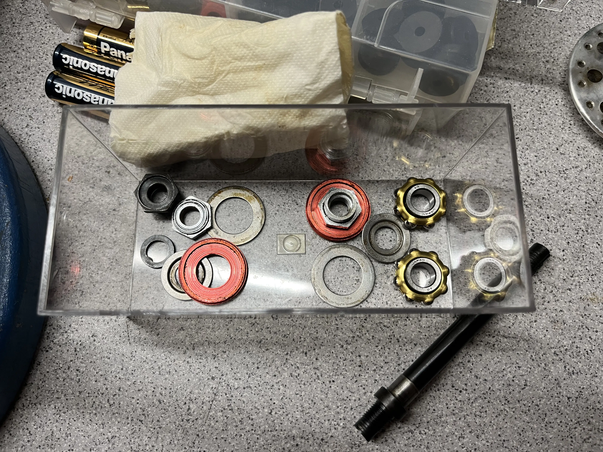
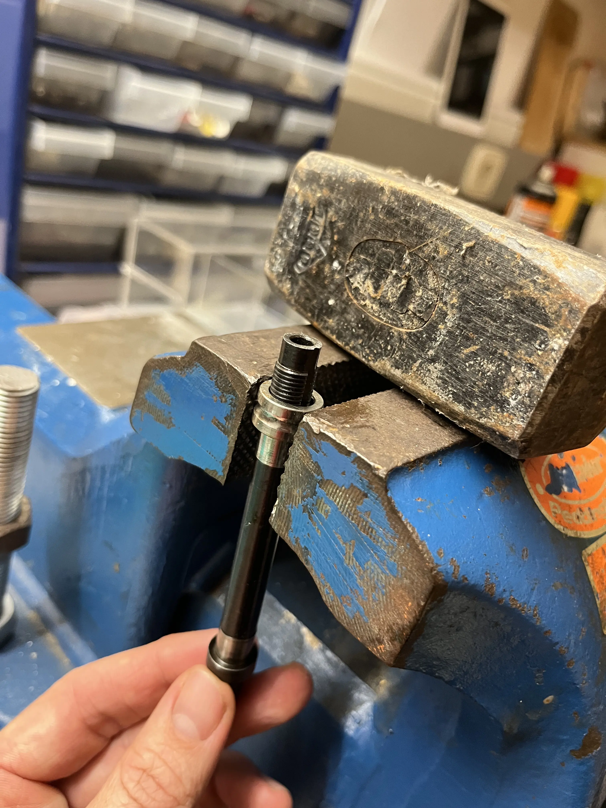
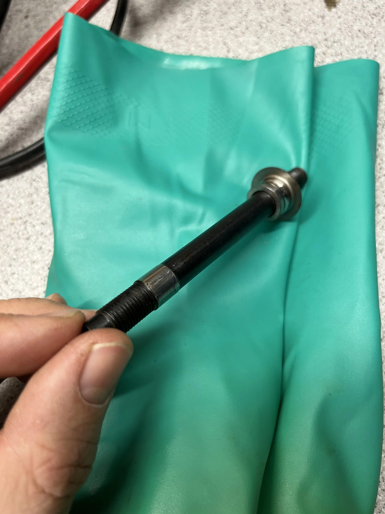

+++
date = 2026-01-30
title = "Reconditioning a Maxi-Car hub"
description = "Rebuilding a well-known 90s hub, known for both reliability and complexity :)"
image = "IMG_5913.HEIC.webp"
tags = ["cycling"]
+++

Maxi-Car hubs are well-known in certain parts of the cycling world.

Over Covid, I restored a Peugeot PX50S (and sold it too quickly, damn!).
That introduced me to the world of randonneuring, a sport (or rather lifestyle),
in which people cycle 200+ kilometeres within a given time limit.
Back in the 1980s, when Europe still had a bicycle industry,
Maxi-Car hubs were well-known for withstanding the wear and tear of long distances.
Thus, they have become something of a collectors item with a myth of supreme quality attached,
and are still sought by randonneurs.

A pair of these hubs found their way into my hands, and they turned quite rough.
Luckily, the required spare part easily available, and I documented the process here.
Looking at the drawing, below we will work to replace items 12-14,
the inner and outer races and the bearings in between.

# Sources and Recommended Reading
The hubs are well documented on the net, but not as much in English,
and on sites that look like they might go offline sooner than later.
My contribution here is the illustration of the process and translation of the manual.

These sites have helped me a great deal:
1. https://www.muzarde.com/reconditionner-un-moyeu-maxi-car/
2. https://www.yellowjersey.org/maxtek.html
3. http://www.blackbirdsf.org/maxicar/

# Parts and Tools
I needed the following tools:
* 17mm wrench
* Burner, one for crème brûlée suffices
* Hammer
* Two wooden blocks of same height
* Grease
* Vice
* Hole key

And the replacement product name in German:
Schulterkugellager E10 NSK 10x28x8 - Messingkäfig.
You need two of these.

# Disassembly
Disassembly was really straightforward for me.
It's important to understand that one side of the axle of the hub has a thicker section.

1. Loosen the locknuts on both sides. Remove where possible.
2. Loosen the red caps. Apply strong pressure to the holes to avoid damaging the delicate aluminium.
3. Remove the caps where possible, and also the dust shields below.
4. Place the hub between two blocks of wood so that the thick-sided piece of the axle looks down but does not touch the bottom
5. Hammer the axle down. This will drive the inner race of the upper side off the axle.
6. Remove and clean everything.
7. Clamp the remaining race on the axle in a vice and hammer it out (let it soak in oil if tough)

# Bearing replacement
Now we'll use different material expansion properties under heat to replace the outer races.
The races are steel and the hub shell is aluminium.

1. Put the bearings in the freezer
2. Fuel your burner
3. Get the ice-cold bearings in ready
4. Heat the flanges of the hub
5. Let the inner race fall out by turning the hub over
6. Immediately insert the ice-cold replacement race
7. Ensure proper seating
8. Let temperatures align
9. Repeat for the other side

Using the burner was really fun and I had a video of it.
Let's hope that I find it again!

# Assembly
1. Clean everything and lay it out in good order
2. Apply a thin coat of oil onto the smooth parts of the axle.
3. Heat one of the new races with the burner.
3. Put one new race onto your vice and leave an opening below so that you can hammer the axle through. Don't forget the dust guard cap. Guard the axle against damage from the ridges in the vice clamps with wood or something similar if possible. Learn from my mistakes. I cut a groove in my axle.
4. That was the most tricky part. Drown everyhing in grease now :D
5. Insert the axle into the hub shell.
6. Using the same technique as before, hammer the other bearing onto the axle until the first threads are through.
7. Put on the bearings and screws and tighten them to push the race into the shell.
8. Remove the screws again to place the dustcaps correctly.
9. Tighten the screws again and adjust bearing tension.

